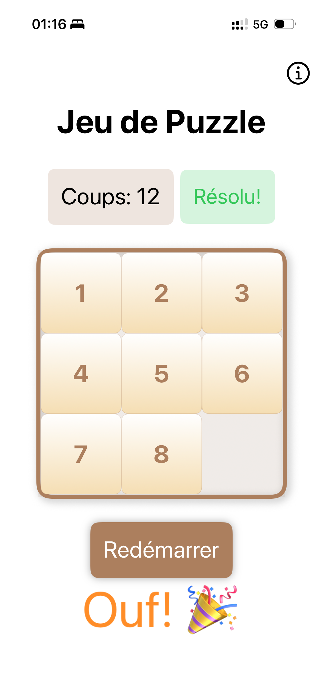

# Test-Ollama-Qwen2.5-Coder-7b

## Description

Ce projet a été initialement conçu pour tester le modèle Qwen2.5-Coder-7b dans Xcode 16.3 en configurant Ollama. Suite à plusieurs itérations infructueuses, j'ai fini par changer le modèle pour utiliser Qwen3-Coder-30B qui tourne sur mon NVIDIA DGX Spark posé sur mon bureau.

Grâce à cette configuration, en 40 minutes j'ai créé ce petit jeu. Avec 20 minutes supplémentaires, j'ai amélioré l'expérience utilisateur, et en environ une heure j'avais le jeu actuel fonctionnel. Il a juste fallu que je pousse sur Testflight pour le rendre disponible aux tests.

La magie du viebcoding local (un peu boosté !)

## Testflight

Le lien Testflight est disponible pendant 90 jours : https://testflight.apple.com/join/hwhagNKn

## License

Ce projet est sous licence MIT. Voir le fichier [LICENSE](LICENSE) pour plus de détails.

